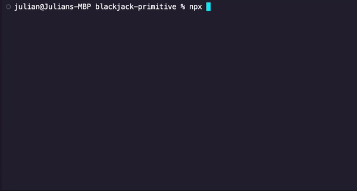

Also Check out the [Python Version](https://github.com/jll38/pyBlackjack) of this Project!

# Blackjack-Typescript


## Overview
The Blackjack project is a console-based simulation of the Blackjack card game, also known as 21. Developed in Node.js, it showcases Object-Oriented Programming (OOP) principles and adheres to the SOLID design principles. The game features a dealer (computer) and a player (user), with the ability to hit or stand as per the classic game rules.

## Setup

### Requirements
- Node.js installed on your system.
- npm (Node Package Manager)

### Installation
1. Clone the repository to your local machine.
2. Navigate to the project directory.
3. Install dependencies:
   ```bash
   npm install
   ```

### Running the Game
To start the game, run:
```
npx tsc index.ts
```
Follow the on-screen prompts to play Blackjack against the computer.

## Project Structure
The project is organized into several key components:

- `Deck`: Manages a collection of playing cards.
- `Hand`: Represents a hand of cards for a player or dealer.
- `PlayingCard`: Defines a single playing card.
- `BlackjackHand` & `DealerHand`: Specialized hand classes for the player and dealer, respectively.
- `Game`: A base class for game logic.
- `Blackjack`: Extends `Game` with specific logic for Blackjack.

## Testing
The project includes unit tests to ensure the reliability of key functionalities like card handling, deck operations, and game logic.

### Running Tests
Tests are implemented using Jest. To run the tests, execute:
```bash
npm test
```
## License
The Blackjack project is open-sourced under the MIT license.
